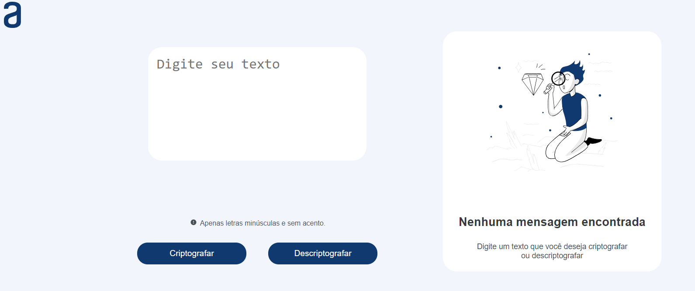
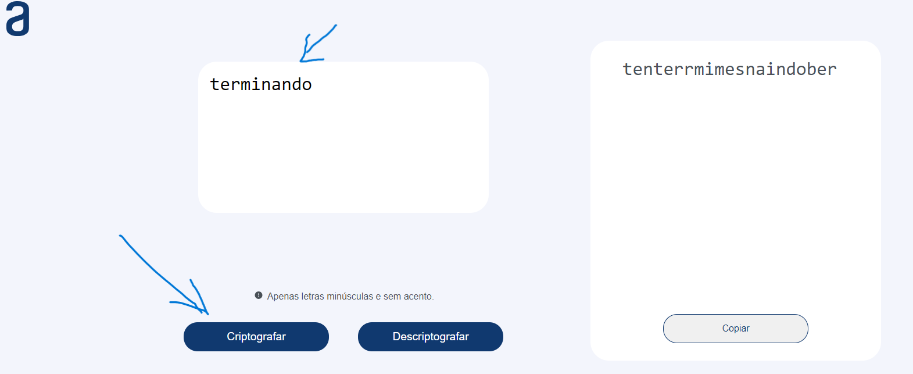
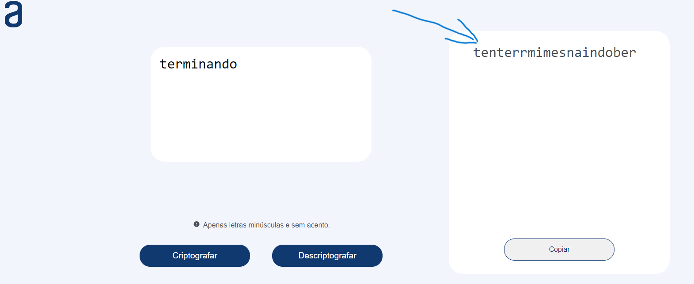

<h1 align ="center"> Descodificador de Texto </h1>

Primeiro desafio da formação Alura+oracle

Desenvolvido por:
  Garcia Mateus - [Linkedin](https://www.linkedin.com/in/garcia-mateus2-581a0b228/) | [Github](https://github.com/Garcia581)

## Indice 
* [1. Descrição do projecto.]()
* [2. Como usar o descodificador de texto.]()
* [3. Quais foram as tecnologias usadas para construir esse projecto.]()

## 1. Descrição do projecto.

Desenvolvido um Decodificador de Texto responsivo, tendo como principal objetivo criptografar e descriptografar palavras. Desafio proposto aos alunos pela ONE Oracle Next Education em parceria com a Alura.

Sobre o desafio:
As "chaves" de criptografia que utilizaremos são:

`A letra "e" é convertida para "enter"`

`A letra "i" é convertida para "imes"`

`A letra "a" é convertida para "ai"`

`A letra "o" é convertida para "ober"`

`A letra "u" é convertida para "ufat"`

## 2. Como usar o descodificador de texto.
`1 primeiro Devemos digitar o texto que desejamos criptografar, no campo que está escrito digite seu texto`

`2 Depois de digitarmos o texto, que nesse caso foi "terminando"  vamos no canto inferior esquerdo e clicar em Criptografar.`

`3 e por ultiimo a palavra criptografada vai ser apresentada no canto superior direito.`

## 3. Quais foram as tecnologias usadas para construir esse projecto

### para este projecto utilizamos 3 tecnologias que são:

- HTML
- CSS
- JavaScript